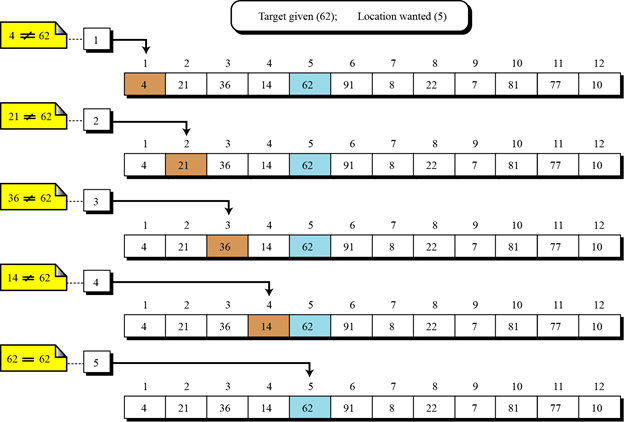
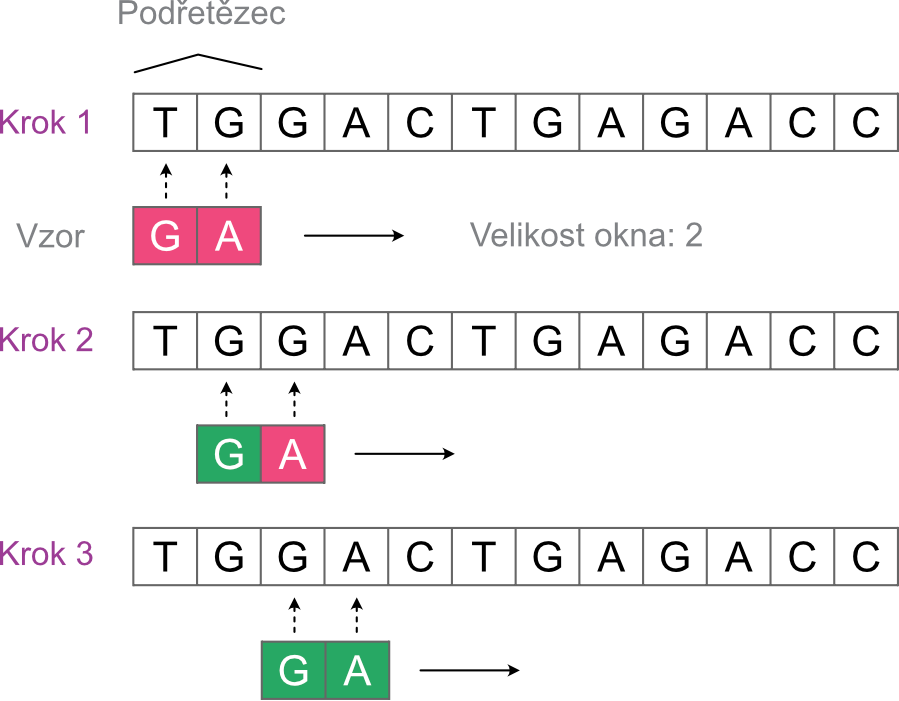
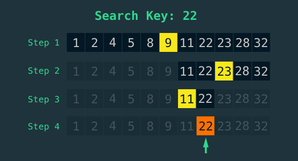

##	Sekvenční vyhledávání v neseřazeném seznamu
Mějme naše data uložena v iterovatelné datové struktuře (např. seznamu, kde pořadí každé hodnoty je dáno jejím indexem). Základní způsob nalezení konkrétní hodnoty pak spočívá jednoduše v tom, že postupně (v sekvenci) projdeme každý prvek seznamu, dokud nenalezneme naši hodnotu. 

>Pokud vyhledáváme v neseřazeném seznamu znamená to, že jednotlivé prvky byly do seznamu umístěny náhodně. Při každém porovnání s hledanou hodnotou může a nemusí dojít k nalezení prvku. Jinými slovy, v každé iteraci je (většinou) stejná pravděpodobnost, že nalezneme hledaný prvek.

 
 

##	Vyhledávání vzoru
V předchozím příkladu jsme vyhledávali vždy jen jeden specifický element. V celé řadě případů je však nutné vyhledávat posloupnost elementů, tzv. vzor. V následujícím příkladu si rozšíříme příklad z předchozího úkolu na vyhledávání vzorů v sekvenci DNA.
Mějme naše data opět uložena v iterovatelné datové struktuře – textovém řetězci. Naivní algoritmus nalezení pozice vzoru opět spočívá jednoduše v tom, že postupně (v sekvenci) projdeme prvky řetězce, dokud nenalezneme přesnou shodu na všech pozicích mezi vzorem a podřetězcem prohlédavané sekvence.

Základní princip algoritmu pro nalezení pozic vzoru v sekvenci může vypadat např. takto:

* Nastav ukazatel v analyzované sekvenci na podřetězec v rozsahu nultý až m-tý prvek, kde m je délka vzoru.
* Porovnej shodu prvků mezi vzorem a podřetězcem.
* Pokud jsou všechny prvky shodné, ulož pozici prostředního prvku podřetězce.
* Posuň ukazatel o jedno pozici doprava.
* Opakuj předchozí kroky dokud existuje oblast, která ještě nebyla prohledána. 

 
 

##	Binární vyhledávání na seřazené sekvenci
Binární vyhledávání využívá výhodu, kterou nám poskytuje seřazení hodnot v datové struktuře. Jedná se o algoritmus typu Rozděl a panuj (Divide and Conquer) s jejichž obecnou podstatou se seznámíme později. Základní myšlenkou algoritmu je postupné rozdělení problému na menší  části. Z řešení dílčích částí poté sestavíme celkový výsledek. Základní princip algoritmu pro vrácení pozice hledané hodnoty vypadá následovně:

* Zkontroluj prostřední prvek. Pokud obsahuje hledanou hodnotu, ukonči hledání a vrať pozici prostředního prvku.
* Pokud je prostřední prvek menší než hledané číslo, zmenši oblast prohledávání na pravou půlku seznamu.
* Pokud je prostřední prvek větší než hledané číslo, zmenši oblast prohledávání na levou polovinu seznamu.
* Opakuj předchozí kroky dokud existuje oblast, která ještě nebyla prohledána. 

Vizuální ukázka pro hledání hodnoty 45 může vypadat např. takto:

